# 数据资产配置--组件

配置了所需要的各种功能组件，

目前逻辑是在角色捡到武器，会遍历这个资产的所有组件配置把他添加到角色上

## BP_TempestStateManagerComponent

基类为C++中的UTempestBaseStateManagerComponent，主要负责状态的管理，类似于Unity中的状态机，但这里面只会记录当前状态，具体的实现则需要能力（Ability）驱动

## BP_TempestAttributesComponents

基类为C++中的UTempestAttributesComponents，负责角色的基础属性，详情看[UTempestAttributesComponents](#UTempestAttributesComponents)

## BP_TempestPropertiesComponent

基类为C++中的UTempestPropertiesComponent，负责角色所拥有的特性，详情看[UTempestPropertiesComponent](#UTempestPropertiesComponent)

# 数据资产配置--特性（GeneralProperty）

## 允许的状态输入特性

通过输入来驱动状态和能力

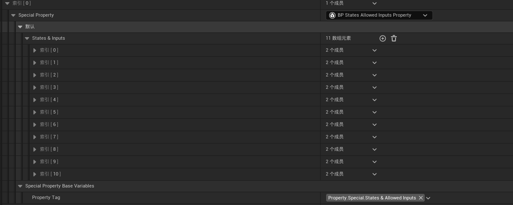

## 玩家速度特性

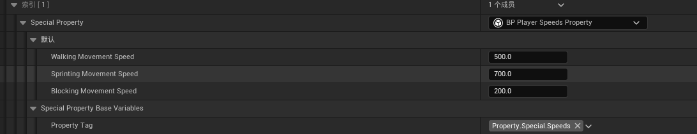

## 特殊能力的蒙太奇配置

因为走的重定向逻辑，像基础的走跑跳就不用在配置了，但有些特殊动画比如死亡攻击之类的就需要特殊的蒙太奇，而且可能每个武器的这些动作都不一样都需要配置

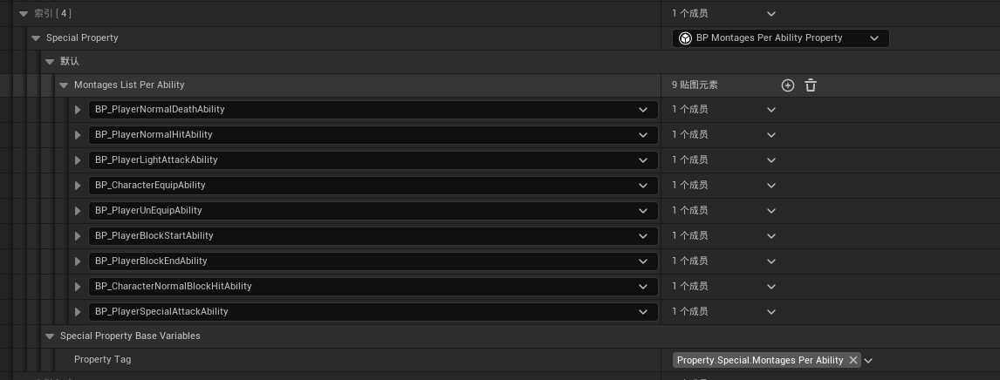

## 状态和能力特性

每一个这个武器或者角色可能拥有的状态都配置出来

## 一个攻击的流程示意(将这几个组件串起来):

输入驱动状态,状态调用能力,一个状态可以拥有多种能力

在玩家的基类BP_ThirdPersonCharacterBasic中调用攻击,具体能不能广播事件见UTempestBaseInputComponent脚本,

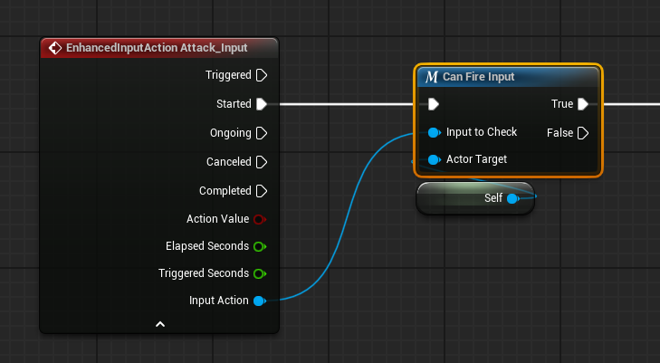

之后将状态设置为攻击状态

这里解释一下切换到攻击状态的原理(后续会移动到UTempestBaseStateManagerComponent这个组件的讲解):

每个状态类的基类UTempestBaseStateManagerComponent

有个构造方法

使用`NewObject`动态创建一个新的状态对象实例

将新创建的状态对象添加到可激活状态列表(`ActivatableStates`)中

设置状态对象的执行者为当前组件的拥有者

这样状态对象知道是哪个Actor在执行它

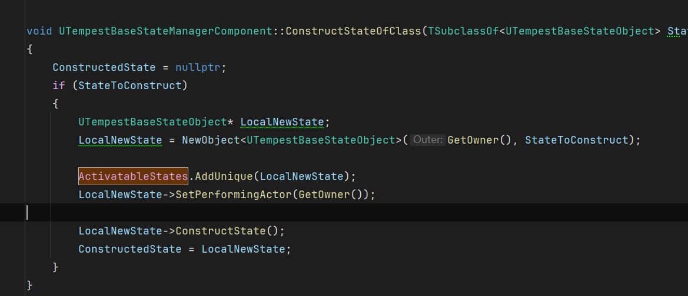

然后再TryPerformStateOfClass尝试执行新的状态的时候需要判断一下条件

比如这个状态被初始化构造了,以及切换这个状态是否需要判断是否可以转化:判断是否可以转化的逻辑在BP_PlayerLightAttackAbility蓝图中编写,

首先判断条件,是否触发了攻击按键

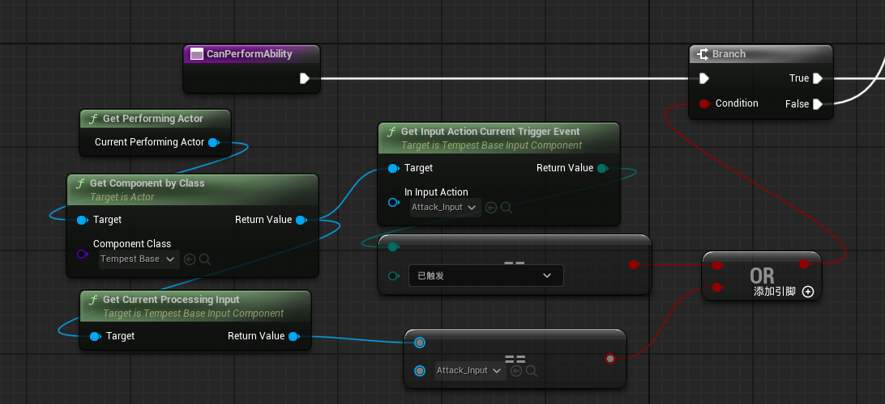

之后需要判断

1.获取攻击动画,然后判断动画是否为空

2/然后判断是否有足够的消耗值

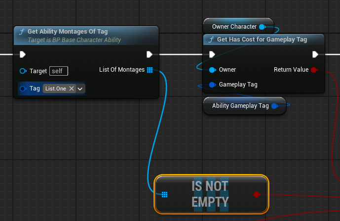

3.判断是否处于战斗状态

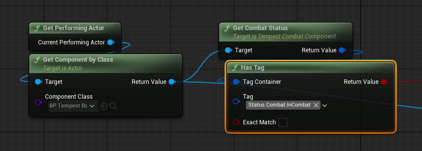

4.是否持有武器

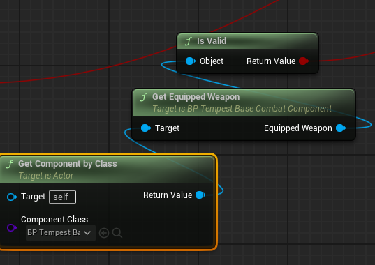

然后这四个条件都通过则可以成功通过判断条件来执行转换状态的逻辑:

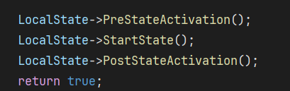

执行该状态激活前状态 -- 开始状态 --状态激活后状态

攻击只在自己的类写了开始状态:

调用自己在数据资产里面的攻击能力BP_PlayerLightAttackAbility,能力组件和状态组件类似

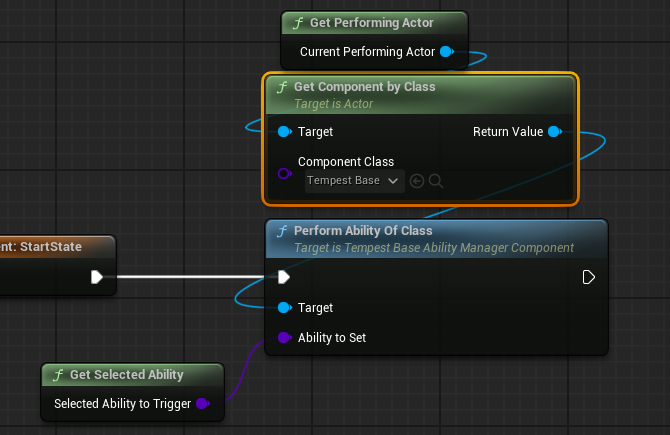

这个能力先获取要攻击的蒙太奇动画并播放

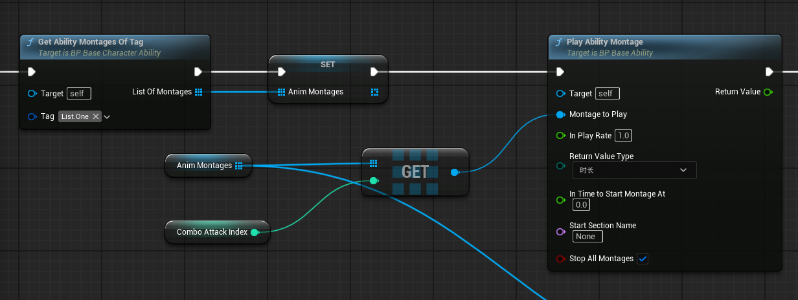

之后增加攻击索引以及计算攻击消耗

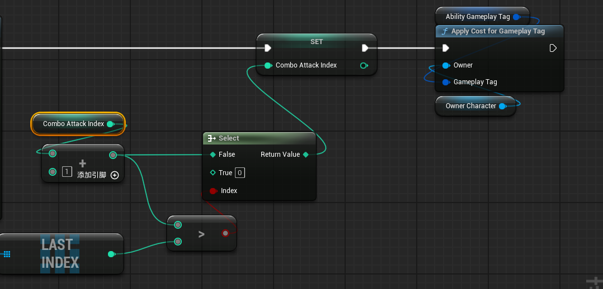

在攻击能力结束时重置索引

接下来只有最后一个问题,如何结束这个状态,在父类中

在开始状态是会启用一个计时,在时间超过StateTimeLimit之后就会调用状态的EndState方法

但目前StateTimeLimit是0秒也就是每次执行完就结束状态

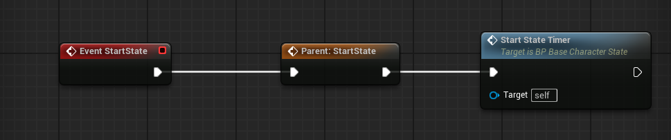

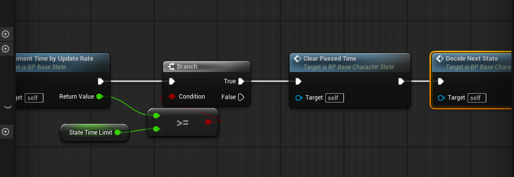

# 功能组件

## UTempestAttributesComponents

用于管理属性和属性修饰器的类

### 主要功能

1. **属性管理**：创建、存储和检索游戏中的各种属性对象
2. **属性修饰器管理**：管理影响属性的修饰器
3. **生命周期管理**：在所有者被销毁时清理资源

### 核心成员变量

- `CreatedAttributes`：存储所有创建的属性对象
- `CreatedAttributeModifiers`：存储所有创建的属性修饰器

### 属性业务类

UTempestBaseAttributeObject

### 示例

装备武器的时候会更新这个武器的属性

在EquipWeapon中会更新这个武器的所有数据属性、特性、状态之类的

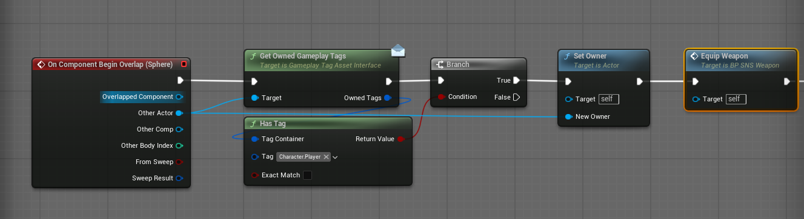

更新属性首先判断，配置的数据存不存在，这个配置是这个武器对应的数据资产，

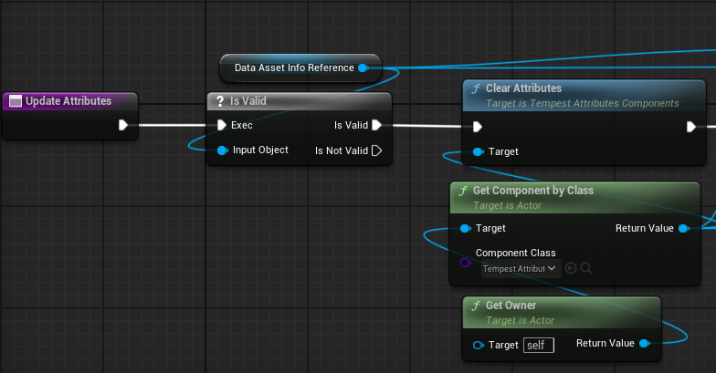

通过GetAttributesToCreate获取一个UTempestBaseAttributeObject*的数组，然后将这组数组添加到CreatedAttributes变量中存储起来

遍历的是这个AttributeToCreat里面的数据，自己配置的

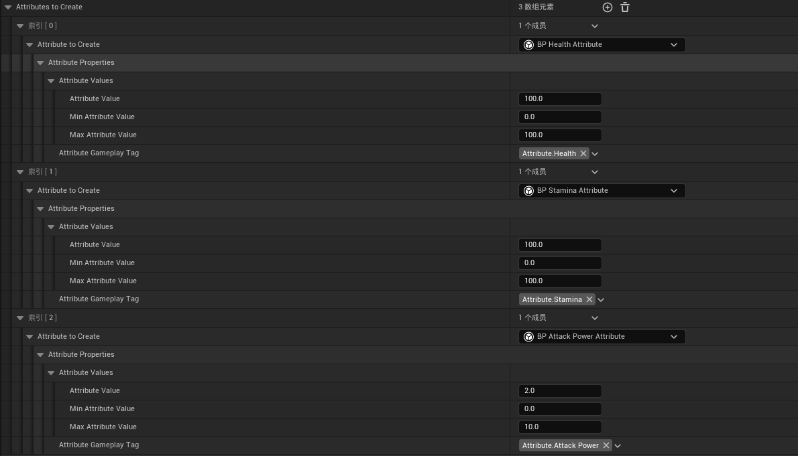

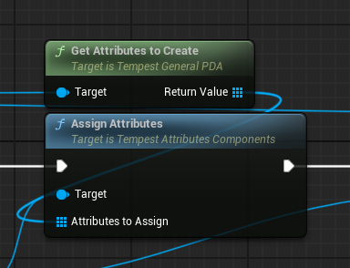

## UTempestPropertiesComponent

管理游戏实体的特殊属性（特性）实例性的类

### Properties和Attribute的区别

1. **Attributes **:
   - 通常表示实体的基础特性或数值状态
   - 如: 生命值、攻击力、防御力、移动速度等（但目前角色的移动速度用的是Properties，不知道为什么）
   - **往往是数值型的、可量化的**
2. **Properties**:
   - 表示更复杂的行为或特殊能力
   - 如: 技能消耗、允许通过按键通过的转态，以及状态和能力，以及动作的蒙太奇
   - 通常是行为导向的、包含逻辑的

一般Attributes只负责提供数据，Properties还会有能力实现
