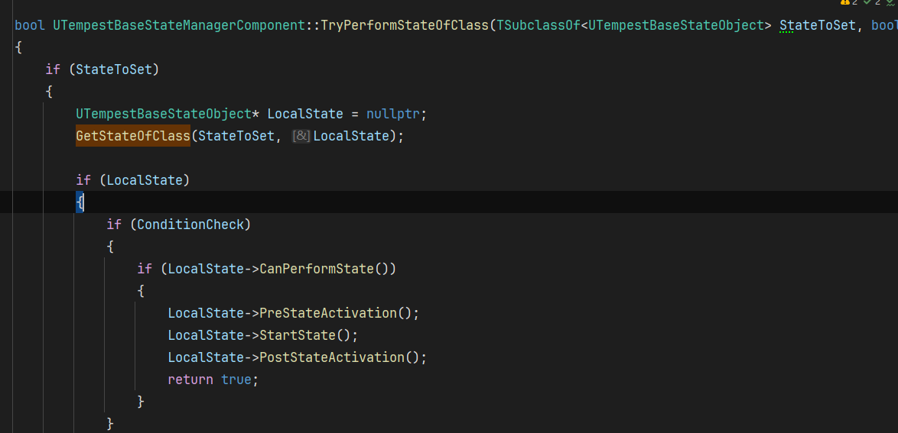
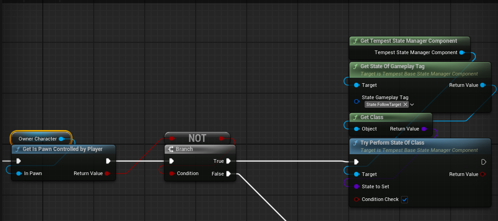
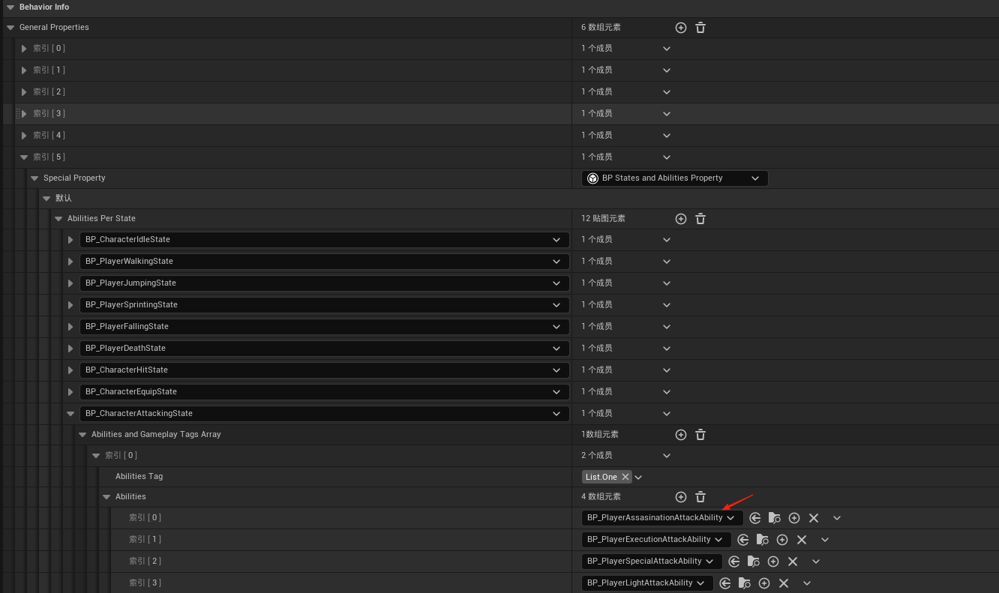

# 数据资产配置--组件

配置了所需要的各种功能组件，

目前逻辑是在角色捡到武器，会遍历这个资产的所有组件配置把他添加到角色上

## BP_TempestStateManagerComponent

基类为C++中的UTempestBaseStateManagerComponent，主要负责状态的管理，类似于Unity中的状态机，但这里面只会记录当前状态，具体的实现则需要能力（Ability）驱动

## BP_TempestAttributesComponents

基类为C++中的UTempestAttributesComponents，负责角色的基础属性，详情看[UTempestAttributesComponents](#UTempestAttributesComponents)

## BP_TempestPropertiesComponent

基类为C++中的UTempestPropertiesComponent，负责角色所拥有的特性，详情看[UTempestPropertiesComponent](#UTempestPropertiesComponent)

# 数据资产配置--特性（GeneralProperty）

## 允许的状态输入特性

通过输入来驱动状态和能力

## 玩家速度特性

## 特殊能力的蒙太奇配置

因为走的重定向逻辑，像基础的走跑跳就不用在配置了，但有些特殊动画比如死亡攻击之类的就需要特殊的蒙太奇，而且可能每个武器的这些动作都不一样都需要配置

## 状态和能力特性

每一个这个武器或者角色可能拥有的状态都配置出来

## 一个攻击的流程示意(将这几个组件串起来):

输入驱动状态,状态调用能力,一个状态可以拥有多种能力

在玩家的基类BP_ThirdPersonCharacterBasic中调用攻击,具体能不能广播事件见UTempestBaseInputComponent脚本,

之后将状态设置为攻击状态

这里解释一下切换到攻击状态的原理(后续会移动到UTempestBaseStateManagerComponent这个组件的讲解):

每个状态类的基类UTempestBaseStateManagerComponent

有个构造方法

使用`NewObject`动态创建一个新的状态对象实例

将新创建的状态对象添加到可激活状态列表(`ActivatableStates`)中

设置状态对象的执行者为当前组件的拥有者

这样状态对象知道是哪个Actor在执行它

然后再TryPerformStateOfClass尝试执行新的状态的时候需要判断一下条件

比如这个状态被初始化构造了,以及切换这个状态是否需要判断是否可以转化:判断是否可以转化的逻辑在BP_PlayerLightAttackAbility蓝图中编写,

首先判断条件,是否触发了攻击按键

之后需要判断

1.获取攻击动画,然后判断动画是否为空

2/然后判断是否有足够的消耗值

3.判断是否处于战斗状态

4.是否持有武器

然后这四个条件都通过则可以成功通过判断条件来执行转换状态的逻辑:

执行该状态激活前状态 -- 开始状态 --状态激活后状态

攻击只在自己的类写了开始状态:

调用自己在数据资产里面的攻击能力BP_PlayerLightAttackAbility,能力组件和状态组件类似

这个能力先获取要攻击的蒙太奇动画并播放

之后增加攻击索引以及计算攻击消耗

在攻击能力结束时重置索引

接下来只有最后一个问题,如何结束这个状态,在父类中

在开始状态是会启用一个计时,在时间超过StateTimeLimit之后就会调用状态的EndState方法

但目前StateTimeLimit是0秒也就是每次执行完就结束状态

# 功能组件

## UTempestAttributesComponents

用于管理属性和属性修饰器的类

### 主要功能

1. **属性管理**：创建、存储和检索游戏中的各种属性对象
2. **属性修饰器管理**：管理影响属性的修饰器
3. **生命周期管理**：在所有者被销毁时清理资源

### 核心成员变量

- `CreatedAttributes`：存储所有创建的属性对象
- `CreatedAttributeModifiers`：存储所有创建的属性修饰器

### 属性业务类

有两种属性，一个就是Attribute另一个是AttributeModifier(属性修饰器)

两者之间的差异

| 维度         | Attribute (属性)    | ModifyAttribute (属性修饰) |
| :----------- | :------------------ | :------------------------- |
| **本质**     | 基础数据容器        | 对属性的操作或影响规则     |
| **可变性**   | 存储基础值          | 定义如何改变属性值         |
| **生命周期** | 通常长期存在        | 可能是临时的或条件性的     |
| **功能**     | "是什么" - 存储状态 | "如何变" - 定义变化规则    |

具体解释:

#### UTempestBaseAttributeObject

每个属性带有两个结构体用来完成业务

FAttributeProperties,用来存储属性的基本属性

FInstancedAttributes,用来封装UTempestBaseAttributeObject* ,为什么要这样,因为Instanced关键字以及UTempestBaseAttributeObject类中含有关键字EditInlineNew,代表这个类我是可以在外面直接选择实例化的,但是一般这个属性会含有多个所以会用数组,但是UE里面用数组直接操作指针不友好,所以需要包一层结构体,来在外面使用

#### UTempestBaseAttributeModifier

每个属性修饰器都会带有一个FAttributeModifierProperties结构体，用于存储这个修饰器的核心信息

属性的Tag、是否无限时间、持续时间、修饰器间隔、添加的数量

注意这里面的Tag是属性的Tag，AttributeModifierTag 这个变量表示的是修饰器的Tag

### 示例

#### 基础属性

装备武器的时候会更新这个武器的属性

在EquipWeapon中会更新这个武器的所有数据属性、特性、状态之类的

在更新属性首先判断，配置的数据存不存在，这个配置是这个武器对应的数据资产，

通过GetAttributesToCreate获取一个UTempestBaseAttributeObject*的数组，然后将这组数组添加到CreatedAttributes变量中存储起来

遍历的是这个AttributeToCreat里面的数据，自己配置的

在需要这个属性的地方可以通过GetAttributeOfGameplayTag这个方法来获取你需要的属性

目前版本角色属性完完全全是根据武器的配置来的，没有自身的基础属性，TODO需要修改

#### 修饰器属性

依旧拿装备武器后更新数据举例，这个属性配置在AttrubuteModifiers中，通过类来构造属性

首先ConstructAttributeModifierOfClass方法会调用Modifier的ConstructAttributeModifier方法

然后再BP_BaseAttributeModifer蓝图类中

首先根据tag获取所有的Attribute

然后将自身存入到CreatedAttributeModifiers

然后根据结构体FAttributeModifierProperties来配置属性

## UTempestPropertiesComponent

管理游戏实体的特殊属性（特性）实例性的类

### Properties和Attribute的区别

1. **Attributes **:
   - 通常表示实体的基础特性或数值状态
   - 如: 生命值、攻击力、防御力、移动速度等（但目前角色的移动速度用的是Properties，不知道为什么）
   - **往往是数值型的、可量化的**
2. **Properties**:
   - 表示更复杂的行为或特殊能力
   - 如: 技能消耗、允许通过按键通过的转态，以及状态和能力，以及动作的蒙太奇
   - **通常是行为导向的、包含逻辑的**

一般Attributes只负责提供数据，Properties还会有能力实现

## UTempestBaseStateManagerComponent

### 概述:

一个用于管理游戏对象状态的组件，实现了状态模式，允许游戏对象在不同的行为状态之间切换和管理。

只允许有一个主动状态,可以拥有多个被动状态

### 核心成员变量:

1. **ActivatableStates**: TArray<UTempestBaseStateObject*> - 存储所有可激活状态的数组
2. **QueuedStates**: TArray<TSubclassOf<UTempestBaseStateObject>> - 存储排队等待执行的状态类
3. **PassiveStates**: TArray<UTempestBaseStateObject*> - 存储被动状态的数组
4. **CurrentActiveState**: UTempestBaseStateObject* - 当前激活的状态对象
5. **OnUpdatedCurrentActiveState**: 委托/事件，当当前激活状态更新时广播

###  工作流程

1. **状态执行流程**:
   - 检查状态是否存在 → 不存在则构造新状态
   - 检查条件(可选) → 执行状态
   - 触发PreStateActivation → Start State → PostStateActivation
2. **状态切换流程**:
   - 当前状态PreLossOfActiveState
   - 设置新状态
   - 广播OnUpdatedCurrentActiveState
   - 原状态PostLossOfActiveState

### 特性业务类

### 示例

详情请见[一个攻击的流程示意(将这几个组件串起来):](#一个攻击的流程示意(将这几个组件串起来):)

### 

# UI框架

大部分功能通过UMS_GameInstance以及WB_MenuMaster组合来实现

内容很多我用到哪写哪

## 显示一个菜单内容

调用UMS_GameInstance，中的方法

传入要打开的界面已经动画类型

然后去UMS_GameInstance添加一个新的UI界面，具体可以看里面的天赋界面

## 返回上一菜单ESC

在WB_MenuMaster中的这个方法，来检测可聚焦UI的按键

在判断回退按键的时候，判断自己的按键

## WB_MenuMaster:

### Load_Content_From_Class:

传入要加载的WBP类，加载这界面的动画类型

检查是否有加载事件正在进行，如果没有，则阻止它并开始清除内容

先检查是否有动画正在播放，返回的是个not paly

设置是否是上一个节点，播放的动画类型，是否聚焦输入框

禁用所有输入，将Input Disabled设置为false

设置为不可点击设置，然后将要加载的界面设置为Target Content Class

将最后一步保存起来，以便在返回菜单时使用。当前显示的就是最后一步存到Current Class

有个一个字典ContentStepMap,Key是目标页面，value是当前页面

# AI行为树的流程：

## 如何进入行为树：

首先是生成NPC，简单过一下后面，可能不是这种方法生成

生成碰撞体用的是，BP_Tempest_AI_Spawner蓝图。他两之间创建起联系通过C++方法GetSpawner创建联系

BP_StandardSpawnerProcessor中根据碰撞检测生成角色，这个是C++中异步加载的方法

这里面会调用自身的生成物体方法

生成物体后，会调用角色基类BP_TempestBaseCharacter中的Possessed

这里面会检测角色有没有武器，没有武器的话会生成武器

会走EquipWeapon的逻辑，这个逻辑见[示例](#示例-1)

之后会根据感官来,来尝试进入装备状态,也就进入了AI行为树第一个状态

## 状态之间的切换:

装备能力的状态结束会有一个动画事件来通知结束当前能力结束

在结束通知里面,会清除当前的能力,然后进入下一个状态

在装备状态的的尝试下一状态

先判断有没有玩家控制的Pawn,有的话进入追寻状态

没有的话进入Idle状态

进入FollowingState,在PreStateActivation,

首先在UpDateFollowingBegavior中将配置的行为树数据绑定起来，这个数据主要是判断各个速度的距离

之后adjust movement speed based on distance,根据距离调整速度

获取玩家和NPC之间的距离

然后根据距离来设置档期啊你速度

# 实际项目

## 天赋树

### 思维导图:

现在玩家属性和能力完全由武器提供,也就是不捡起武器,玩家将没有任何属性和能力,所以需要做出修改

优先看能不能通过覆写组件来实现，不行在新加

逻辑层面分为四个部分

- 角色:首先需要新增一个数据资产CharacterInfo,专门用来存储玩家的基础属性,以及一些特性,对于角色树来说,我需要存储一个字典Key为技能Tag,value为技能的等级.代表玩家当前拥有的技能.
- 能力:首先现在能力的属性比较少,需要新增技能的最大等级,前置技能的Tag以及等级,以及各种UI图标,以及在释放技能时需要判断天赋数中是否存在这个技能,其余不变.
- 属性:在UTempestBaseAttributeObject中添加新的结构体FAttributeToAbilities，里面添加新的
- 学习天赋：当天赋满足学习条件时，更新Character Info

### 实现：

UI显示

在BP_PC_TCF_BasePlayerController 添加打开天赋界面的函数

# 研究

## 武器系统集成大部分属性和能力的优缺点

### 优点：

- 获取组件和属性更加方便，因为所有的都集成在一起了你想获取某个组件，直接按照下面选择你想要获取的组价就可以获取
  
- 所有的数据也都在一起方便保存和读取

### 缺点：

#### 多装备冲突

不支持多装备，因为他每次装备都会清除属性，比如左手剑右手盾这种情况会因为清除属性只会使用最后装备的属性，以及衣服防具这类装备也会和武器冲突，但如果像只狼那样就一把太刀一套衣服一直玩的话这个问题到不大

#### 配置繁琐且有问题(这个问题可能是因为我自身)

配置很复杂很复杂，策划进行配置的话会有难度，因为我都要看晕了，就拿配置技能来举例，我需要在众多没有提示的路径里面找到GeneralProperties的索引5然后在这个里面的众多状态找到玩家的攻击状态然后再里面的Abilities里面，添加自己的技能

但是到这一步并不算完,因为你会发现你只是把这个技能配进来了,但技能的属性在哪里配置?

技能的基类里面有做出属性的声明

接下来才是变态的,技能配置,目前技能拥有的属性较少,后期可能还得加属性比如等级之类,目前的属性配置在两个地方配置第一个是在你的技能蓝图里面的变量配置,没有读表这一步,策划想改点cd什么的需要再程序的蓝图里面修改,应该是不合理的

其次他也不是全在蓝图里面配置,有些属性还是在数据资产里面配置

就比如你的蒙太奇动画，需要在索引四里面找到对应的进行配置

这整个技能的配置逻辑给我的感觉就是既想要解耦但是又耦合在一起，很奇怪。

#### 对于技能树来说

这是我做的demo里面的属性配值，有些属性，比如技能所在的技能树节点，前置条件，等级，技能描述，

其中像前置条件，技能所在节点，技能的最大等级，数值，以及技能描述这些都是和策划相关的内容，

但现在我如果在旧的基础上改就会有两个疑问我是单启一个类还是就在技能的基础属性里面改

在基础里面改的话策划就配置不了这个技能，

我预想的改动是整个数据资产里面的数据是只有程序能修改，因为数据资产既可以读也可以保存，然后所以需要策划配置的根据不同的模块分成不同的表

