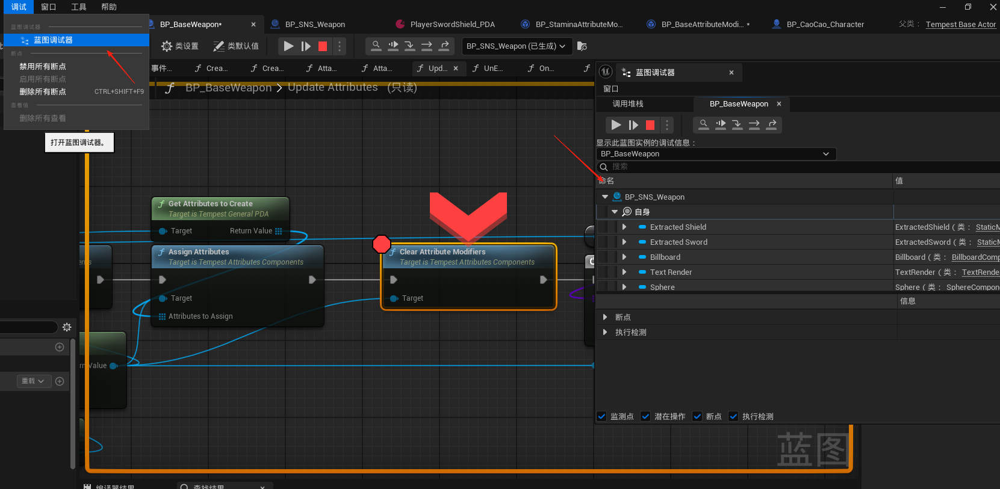
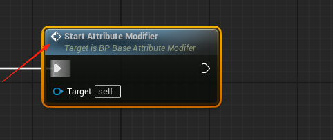
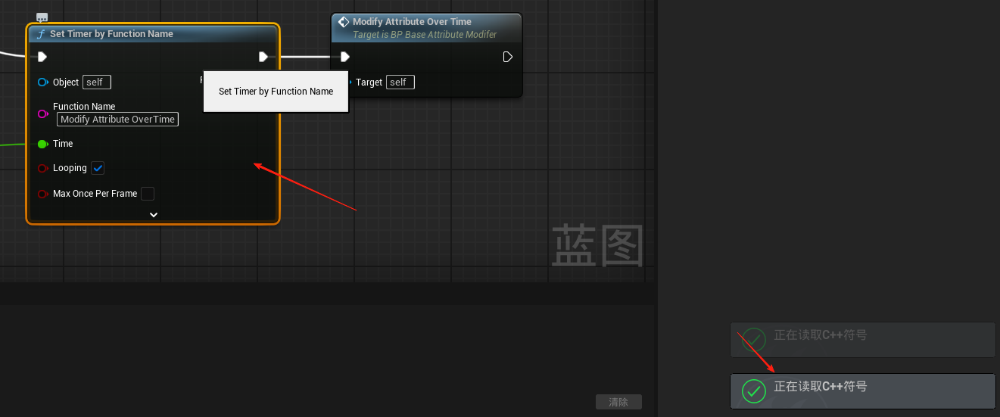

在需要断点的地方F9可以断点，点调试里面的蓝图调试器可以查看调用的信息

如果一个一个方法前面有个箭头，代表这个方法是在事件图表里面定义的，在事件图表里面去实现

如果点击一个方法右下角有个正在读取C++符号且跳转不到IDE中说明是UE自带的方法，去UE官方找实现

其他的方法是都可以跳转的

蓝图与C++之间交互是通过宏来实现的，只有被宏定义了的方法变量类才会进入UE的声明周期被管理，不然就得你手动管理，不同的宏关键字有不同的效果，比如在蓝图中显示，在蓝图中可编译/复写等等

## 基础概念对应

| Unity 概念 | UE 概念             | 说明                 |
| :--------- | :------------------ | :------------------- |
| GameObject | Actor               | UE 中的基础对象      |
| Transform  | SceneComponent      | 处理位置、旋转、缩放 |
| Prefab     | Blueprint Class     | 可复用的资源模板     |
| Scene      | Level               | 游戏场景             |
| Script     | Blueprint/C++ Class | 游戏逻辑实现方式     |

## 常用 API 对应

### 对象管理

- **Unity**: `Instantiate()`
  **UE**: `UWorld::SpawnActor()`
- **Unity**: `Destroy()`
  **UE**: `AActor::Destroy()`

### 组件系统

- **Unity**: `GetComponent<T>()`
  **UE**: `GetComponentByClass<T>()`
- **Unity**: `AddComponent<T>()`
  **UE**: `AddActorComponent`

### 类型转化

- **Unity**: `Rigidbody rb = GetComponent<Rigidbody>();`
  **UE**: `AMyActor* MyActor = Cast<AMyActor>(SomeActor)`

  

## 常用方法

## 1. 对象有效性检查

| Unity                 | Unreal Engine (蓝图)   | Unreal Engine (C++)               | 说明             |
| :-------------------- | :--------------------- | :-------------------------------- | :--------------- |
| `obj != null`         | **Is Valid** 节点      | `IsValid()` 或 `IsValid(对象)`    | 检查对象是否有效 |
| `Destroy(gameObject)` | **Destroy Actor** 节点 | `Destroy()` 或 `Actor->Destroy()` | 销毁对象         |

## 2. `Transfrom`操作

| Unity                  | Unreal Engine (蓝图)   | Unreal Engine (C++)  | 说明     |
| :--------------------- | :--------------------- | :------------------- | :------- |
| `transform.position`   | **Get Actor Location** | `GetActorLocation()` | 获取位置 |
| `transform.rotation`   | **Get Actor Rotation** | `GetActorRotation()` | 获取旋转 |
| `transform.localScale` | **Get Actor Scale**    | `GetActorScale()`    | 获取缩放 |

## 3. 时间控制

| Unity              | Unreal Engine (蓝图)           | Unreal Engine (C++)                        | 说明          |
| :----------------- | :----------------------------- | :----------------------------------------- | :------------ |
| `Time.deltaTime`   | **Get World Delta Seconds**    | `GetWorld()->GetDeltaSeconds()`            | 帧间隔时间    |
| `Invoke()`         | **Delay** 节点                 | `GetWorld()->GetTimerManager().SetTimer()` | 延迟执行      |
| `StartCoroutine()` | **Timeline** 或 **Async Task** | `AsyncTask` 或 `Latent Actions`            | 协程/异步操作 |

## 4. 调试与日志

| Unity              | Unreal Engine (蓝图)  | Unreal Engine (C++) | 说明       |
| :----------------- | :-------------------- | :------------------ | :--------- |
| `Debug.Log()`      | **Print String** 节点 | `UE_LOG()`          | 打印日志   |
| `Debug.DrawLine()` | **Draw Debug Line**   | `DrawDebugLine()`   | 绘制调试线 |