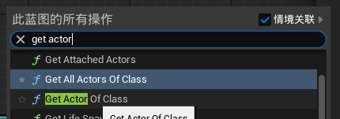
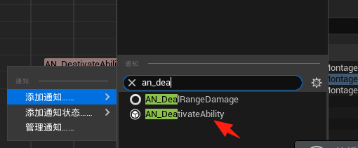
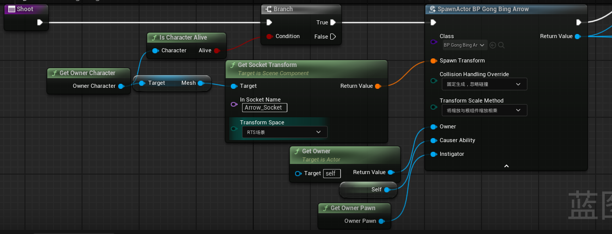
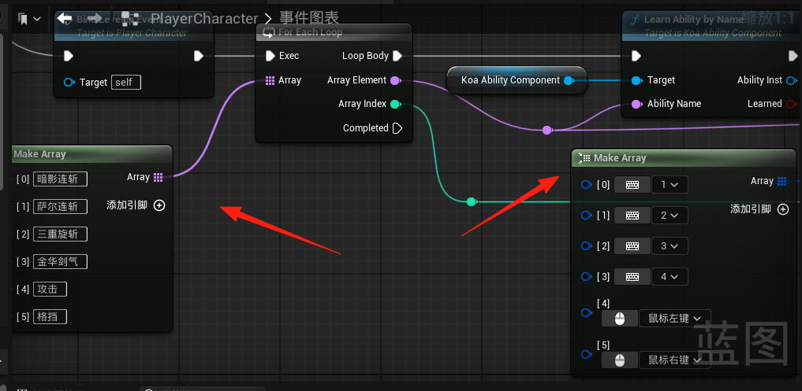

---

---

# 前言

大体分为两个流程,一个通用的流程,一个是具体的需求

# 基础设置篇

在内容浏览器中的设置将里面的东西都勾选,不然可能找不到对应的文件

蓝图勾选这个,不然不显示父类的变量

编辑器偏好设置-视口-翻转中部鼠标,这样你的鼠标中键可以想unity那样拖动视图

# 学习篇

这个篇章主要介绍各种我学的东西

## UI播放MP4视频

首先创建媒体播放器,勾选配套的MediaTexture

然后右键媒体纹理给他增加一个材质,

然后打开媒体播放器选择你的视频文件

然后材质的材质域改成用户界面

然后再控件蓝图里面将图片的笔刷选择你刚刚设置的材质即可

## 蓝图通信

### UI调取自身子物体的方法

首先我在有个空间蓝图中写一个方法

然后我将这个子物体拖到另一个控件蓝图中,并且勾选右上角的是变量

这样你就可以在父物体的控件蓝图中编辑这个物体里面的函数和变量

实例之间的场景通信

## UE蓝图中的事件

# 模型篇

## 新加入模型流程(**人型使用**)

### 增加武器插槽

需要在对应的骨骼上增加才能让角色使用武器,因为是把武器放到对应的插槽上

可以搜索SK_Mannequin,这个角色拥有大部分的插槽,为保证代码的正确运行,需要保证名字以及物体的一致

右键你的骨骼节点,增加插槽,按照模板案例的名字来,需完全一致,

然后添加一把示例武器

###  IK绑定

右键你的骨骼网络体,点击IK绑定

 

在IK绑定界面依次点击两个按钮,要求骨骼命名一致

 

右键修改完成的IK文件,选择创建IK重定向器

 

上方选择已经设置好的IK,将自己的继承过去

 

选择root节点,将平移模式改成全局缩放

 

### 动画蓝图

右键你的骨骼网络体,选择动画蓝图

 

对比骨骼动画是否正确可以将模型和继承的模型移动一下,方便观察模型骨骼动作

 

绑定重定向

 

 

### 绑定角色蓝图

创建对应的角色蓝图类,并绑定动画蓝图还有模型

## 非主角模型

## 衣服笔刷

选中衣服右键创建布料

然后激活布料绘制

绘制值越小衣服的摆动越小

衣服的摆动幅度可以根据刚度和阻尼来,这个值越小衣服越软

对于直接从外面导入的布料,可以先进行一波从顶点颜色进行复制

# 人物动作篇

## 主角移动

目前demo版本导入的动画以SK_Mannequin这个模型为基础

如果动画的制作直接以人物为基础而不是这个小白人则需要进行重定向

配置DT_Animset这个表格,主角基础移动都在这个表配置,这个表是因为,主角在拿不同的武器会有不同的动作,目前人物默认拿的是SwordAnimsetPro,所以配置这个数据

## 人物移动站立动画逻辑

**注释:动画蒙太奇和动画蓝图是通过骨骼网络体创建的联系**

创建一个混合空间1d,将对应的动画序列拖入,并且修改值

将创建好的混合空间拖入,根据人物的速度来判断当前的状态是移动还是站立

点开事件图表来获取人物的speed

## 人物死亡动画逻辑

如果你角色蓝图类建立的时候,继承自正确的基类,那么你的角色便会继承PawnControlledComponent

这个类监听了死亡的事件,在收到死亡的时候会DeathMontage这个变量的值播放死亡的动画

在你的角色蓝图中给DeathMontage赋值

## 制作人物技能

### 前言(先看前言,了解流程)

**首先制作动画蒙太奇**

**然后制作技能**

**当技能制作完成后需要配置Table**

**创建完绑定关系后需要到角色蓝图与技能发生绑定关系**

### 制作蒙太奇

首先将动画序列先变成动画蒙太奇,然后给这个蒙太奇动画添加通知

这个通知是这段动画期间可以造成伤害,

这个通知是技能可以进入下一个蒙太奇的时间,也就是可以取消后腰的时间

### 制作发射技能(类似弓箭手射箭)

#### 制作发射物蓝图

制作一个基类为BP_ProjectileBased的发射物蓝图,这个基类自动包括了碰撞物的检测和造成伤害

具体的逻辑在这里面

将里面的CollisionMesh中的静态网格体,选择为自己要发射的物体,发射物便制作完成

#### 制作发射函数

创建一个基类为BP_InstantShoot_Ability蓝图代表我们的技能蓝图

主要还是通过SpawnActor From Class这个组件来生成物体,可以查询项目当中的BP_GongBing_ShootArrow这个蓝图来查看具体生成过程,其中的Class参数要选择上一步制作的发射物

### 制作列表技能(一个技能多个蒙太奇)

创建一个基类为BP_ListAbility蓝图代表我们的技能蓝图

在技能蓝图中添加你需要播放的动画蒙太奇,多个蒙太奇按顺序播放

### 配置Table

配置DT_Abilities_Active_Monster 这个表

配置这个选择你的攻击蓝图

在配置另外一个表DT_PawnTemplates_Default

这个填你刚刚配置的技能的名字

### 配置Npc蓝图

最后需要选中你的人物蓝图,搜索pawn,在PawnTemplateName中配置你在DT_PawnTemplates_Default中填写的名字

### 配置主角蓝图

主角的动画系统和npc系统是不一样的

找到主角的蓝图文件PlayerCharacter,在事件蓝图里面进行技能的绑定,左边是配置的技能名字,右边是技能的按键

# 功能篇

# DataTable篇

# 实际需求篇

## 锁定敌方人物

分为两部分一个是让自己的胶囊提始终面向目标,另一个是自己的摄像机始终面对目标

//锁定敌方是主角特有的功能所以在,PlayerCharactar蓝图中进行编写,

### 在基类PawnAbilityComponet,定义基础逻辑

创建一个SetLockTarget函数来实现锁定目标

用一个Locking Target变量来存储我们需要锁定的目标

主要通过Pawn中的变量`[bUseControllerDesiredRotation](#bUseControllerDesiredRotation) 和[bOrientRotationToMovement](#bOrientRotationToMovement) 来实现

首先判断这个锁定目标是否有效,通过自身的[GetOwnerCharacter](#GetOwnerCharacter)获得自身的CharacterMovement方法来改变上面两个变量

如果有目标则取消角色的自动旋转,并以摄像机方向旋转

在子类KoaAbilityComponent()来添加额外的逻辑,加一个锁定的图标,

即在锁定的目标身上生成一个BP蓝图,这里面有一个UI元素

### 摄像机视角锁定

在主角的tick中编写摄像机逻辑,获取自身身上的LockingTarget变量中存储的目标,

如果目标有效且目标存货然后让摄像机锁定目标,如果目标死亡则再次调用SetLockTarget函数,将变量`[bUseControllerDesiredRotation](#bUseControllerDesiredRotation) 和[bOrientRotationToMovement](#bOrientRotationToMovement) 恢复正常

# UE自带变量方法解释使用

## bOrientRotationToMovement

UCharacterMovementComponent组件的一个布尔变量，用于控制 角色是否自动朝向移动方向旋转。它是实现角色“移动时自然转向”的核心参数，常用于 RPG、动作游戏等需要角色根据输入方向调整朝向的场景。

当 bOrientRotationToMovement = true 时：
角色会 自动旋转，使其正面朝向移动方向（如 WASD 输入方向或 AI 移动路径）。

适用于：第三人称角色移动、AI 寻路移动等。

示例：按下 `W` 键向前移动时，角色会自动面朝前方；按下 `A` 向左移动时，角色会向左转身。

当 bOrientRotationToMovement = false`时：
角色 不会因移动而自动旋转**，需手动控制旋转（如通过 Controller 或动画蓝图）。

适用于：第一人称视角、固定朝向的敌人（如射击游戏中的炮台）。

## bUseControllerDesiredRotation

是 APawn类（及其子类，如 ACharacter）的一个布尔变量，用于控制 Pawn 的旋转行为是否由其 Controller（控制器）的期望旋转（DesiredRotation）决定**。

当 bUseControllerDesiredRotation = true时：

Pawn 会自动旋转，以匹配其 Controller 的 `DesiredRotation`**（即 Controller 希望 Pawn 朝向的方向）,也就是摄像机方向。

适用于：

玩家角色：让角色始终跟随玩家输入方向（如第三人称游戏的视角朝向）。

AI 角色：让 AI 自动转向目标（如敌人朝向玩家）。

当 bUseControllerDesiredRotation = false 时：

Pawn 的旋转由其他方式决定（如 bOrientRotationToMovement、物理模拟、动画蓝图等）。

# 项目自带的通用方法或变量

## 

