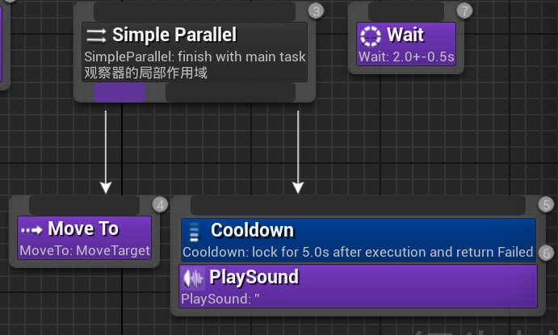
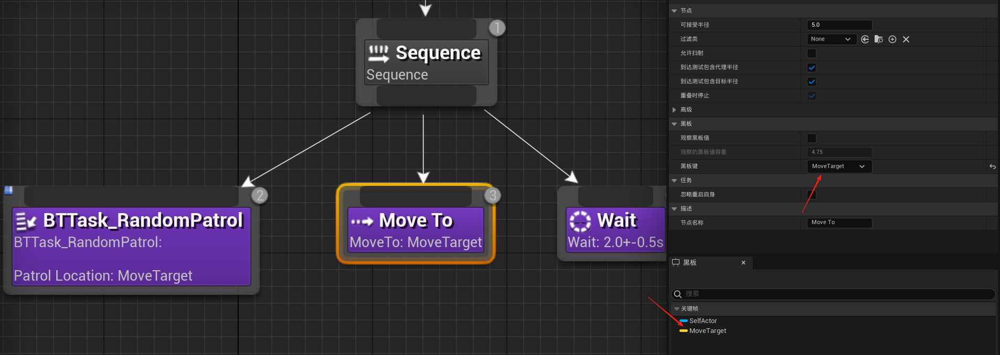

# 行为树

## 组合节点:

### Selector:

一直执行节点直到有成功的节点,就不在往后执行了

### Sequence:

按顺序尝试执行,找到失败的就不会再往后执行了

### Simple Parallel:

在执行一个任务时,在后台协同执行另一个任务

这种就表示在移动过程中同时可以播放一个语音

完成模式为直接时,在主任务完成后后台任务也会完成

完成模式为已延时时,在主任完成后,后台任务也完成才会完成

## 树节点的初始化:`InitializeFromAsset`

用于行为树节点`UBTNode`派生类的初始化

### **调用时机**

1. **行为树加载时**
   当行为树资产（`UBehaviorTree`）被加载到内存中（如地图启动或动态加载时），引擎会遍历所有节点并调用 `InitializeFromAsset`。此时节点会从资产中读取配置数据（如黑板键、参数等）。
2. **节点动态创建时**
   如果通过代码动态生成行为树节点（如 `SpawnActor` 后挂载行为树），也会触发此方法。
3. **热重载（Hot Reload）后**
   在编辑器环境下修改行为树并热重载时，节点会重新初始化。

# Task方法

## 简易巡逻:

官方自带的`MoveTo`方法,将它的黑板键指定为要移动的目标点,然后在写一个方法获取目标点设置为黑板键即可

# 蓝图通信

关卡蓝图可以获得场景里所有的物体的引用